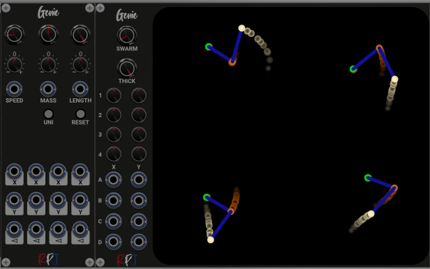
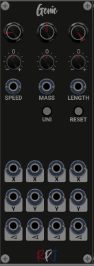
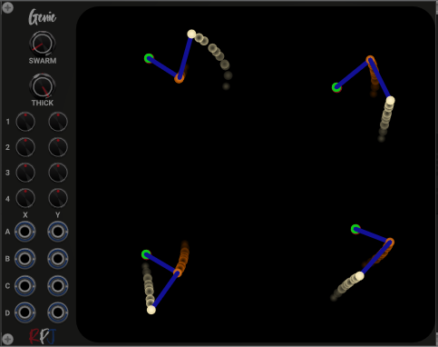
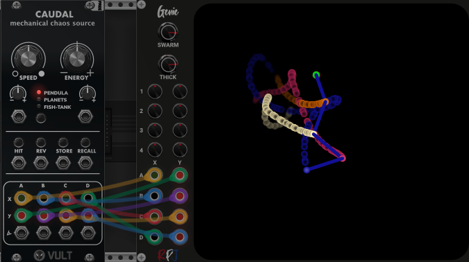

# Genie / Double Pendulum

In physics and mathematics, in the area of dynamical systems, a double pendulum is a pendulum with another pendulum attached to its end, forming a simple physical system that exhibits rich dynamic behavior with a strong sensitivity to initial conditions. The motion of a double pendulum is governed by a set of coupled ordinary differential equations and is chaotic. Its working can be seen in this [video](https://en.wikipedia.org/wiki/Double_pendulum#/media/File:Trajektorie_eines_Doppelpendels.gif) 

Genie provides this chaos. It cointains 4 double pendulums whose behaviour can be controlled making changes to parameters using the knobs and cv's. The different parameters will be described below and are speed, Mass and Length.
For each of the 4 pendulums we have 3 outputs. One that give the x position, one the y position and one the angle.

Genie also has an expander that can be used to visualize the 4 pendulums. Just put the expander to the right of the module and all the active pendulums should be shown. You can move them on the screen by using the knobs to control their x- and y position or you can use the mouse to drag the central/top mass. Colours can be managed by using the controls available in the menu.

## Genie Module

These are all the knobs, buttons and settings that control the Genie Module.

### Speed

The speed controls the speed of the pendulum. It can go from very slow to extemely fast. It means that the values for the x, y and angle will change accordingly. You can set the Speed using either the knob or a cv input. When you add the expander you can notice the speed as the pendulums will change very fast or very slow.

### Mass

The mass controls the mass of the masses in the pendulum. You can set the Mass using either the knob or a cv input. If you add the expander to the right of the module you can see the changes of the masses as they will change as you turn the knob or control the cv by any external signal.

### Length

The Length controls the lengths of the arms of the pendulum. It will result in larger values of the outputs. 

### Uni
The uni button (unipolar) controls if the outputs will be only positive or can be both positive and negative. When it is enabled it will color red and only positive output values will be produced.

### Reset
The reset button will bring all the pendulums back into a new random start position. 

## Genie Expander

These are all the knobs, buttons and settings that control the Genie expander.

### Swarm

This knob controls how fast a new mass is drawn

### Thick

This knob controls how long a mass will stay visible

#### [1..4]

These knobs control the positions of the pendulums on the screen. The pendulums can also be moved by dragging the root mass around the screen.

### [A,B,C,D][X,Y]

These inputs can be used to show signals on the screen from other modules. For example you can use caudal from Vult as shown in the picture below.

