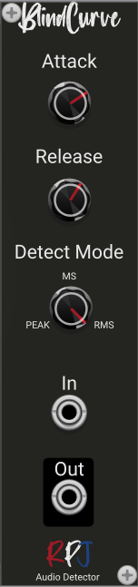

# Blindcurve / Audio dtetector 

Blindcurve is a Polyphonic audio- or envelope detector. An envelope detector is sometimes referred to as an envelope follower in musical environments. It is used to detect the amplitude variations of an incoming signal to produce a control signal that resembles those variations. Blindcurve lets you control the  attack or rise time and decay or release time properties. 

In some audio processing processes, such as signal compressor or automatic wah effect, the characteristic of attack/rise time and decay/release time might produce some benefits and need to be controlled to produce various unique results.

## Controls
The **Attack** knob controls the attack or rise time. It's slope is measured in dB.

**Release** controls the decay or release time and it's slope is also measured in dB.

The **Detect Mode** knob controls the detection mode so it tracks either the peak, mean-square (MS) or root-mean-square (RMS) value of an audio signal.

## Credits
The module is an implementation of the formula's and theory from the book [Designing Audio Effect Plugins in C++](https://www.amazon.co.uk/Designing-Software-Synthesizer-Plugins-Audio/dp/0367510464) from Will C. Pirkle.