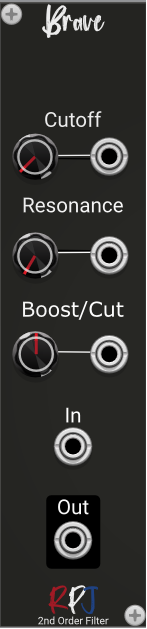

# Brave / 2nd Order Parametric EQ Filter: Non-Constant-Q 

Brave is a Polyphonic EQ Filter. Parametric EQs allow you to adjust the center frequency, Q, and boost or cut, creating any arbitrary  bumps or notches in the frequency response. The PEQ filter (also known as a peaking filter) is designed  to generate symmetrical boost/cut responses. A true digital PEQ not only has independent controls,  but also each control only varies one coefficient in the filter. The PEQs in this section afford the same  frequency response but adjustments in any parameter require a recalculation of all the coefficients.

Brave, our first PEQ design is non-constant-Q, which means the bandwidth varies depending on the boost/  cut value. Many highly revered analog PEQs are non-constant-Q, and some believe them to be more  “musical” than the constant-Q variety.

## Controls
The **Cutoff** knob controls the center frequency of the filters.

**Resonance** controls the quality factor Q.

The **Boost/Cut** knob controls the gain/attenuation (boost/cut) in dB.

From the menu the Biquadric **structure** can be selected that will be used for the filter arithmetic. There are 4 options to select from: Direct, Canonical, TransposeDirect and TransposeCanonical.

The direct forms (direct form and transposed direct form) are the simplest to implement but are also the  most susceptible to errors. The transposed canonical form is generally regarded as the best structure 
for floating point implementations due to the way the multiple summers split the work and add similarly sized values. There are also pros and cons with using the various structures with modulation  of the filter frequency, especially when the modulation value changes rapidly. 

## Credits
The module is an implementation of the formula's and theory from the book [Designing Audio Effect Plugins in C++](https://www.amazon.co.uk/Designing-Software-Synthesizer-Plugins-Audio/dp/0367510464) from Will C. Pirkle.