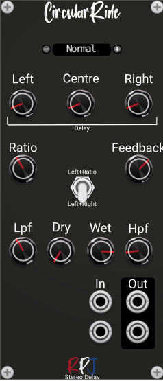

# Circularride / Audio dtetector 

Circularride is a Polyphonic Stereo Delay with at the moment 4 delay algorithms (more to come). The algorithms can be selected using the small buttons next to the display at the top. The maximum delay time for the module is sat at 2 seconds and the user can adjust the delay time, feedback, and wet/dry mix. 

The supported algorithms (at the moment) are:
**Normal**, this is a stereo delay which has 2 digital delay lines (DDL). This stereo delay with feedback simply combines two DDLs with wet/dry mix capabilities along with  a single feedback control that governs both left and right feedback values. The knobs that are active in this mode are **Left** and **Right** for setting the delay times, **feedback** (which controls both left and right) and **dry** and **wet** (also controls left and right). 

The **PingPong** delay crosses both the input and feedback paths to the opposing channel. It produces a circular kind of delay sound that starts in the center then moves to one side, then the other side, then back to the center where it starts all over. A key ingredient is the ability to set the left and right  delays as ratios of one another, which can be done by turning the **ratio** knob. When the ratios are perfect (1:2, 3:5, 8:7 etc.) the effect becomes quite rhythmic in nature. If the delay times are identical across channels, then the ping-pong effect is usually lost. 

**LCRDelay**, the Left-Center-Right (LCR) delay is based on the Korg Triton delay effect. There are three delay lines and only the center includes a feedback path. The delay time for each  channel (L, C, and R) is independently adjustable using the control knobs (**Left**, **Centre**, **Right**). The filters in the feedback path can be bypassed (this can be done from the modules menu settings **Enable Low Pass filter** and **Enable High Pass filter**) so that they may be used alone or together in series. By turning the **HPF** and **LPF** knobs one can set the the center frequency of the filters.

## Controls
There is one other control that is not yet mentioned. This can be set by the switch in the middle of the module. It selects how to update the left and right delay times. The user can either select **Left+Ratio** or **Left+Right**. This is useful for the ping-pong algorithm where the effect is usually inaudible when the left and right delay times are identical and the left and right channels contain correlated signals.

## Credits
The module is an implementation of the formula's and theory from the book [Designing Audio Effect Plugins in C++](https://www.amazon.co.uk/Designing-Software-Synthesizer-Plugins-Audio/dp/0367510464) from Will C. Pirkle.