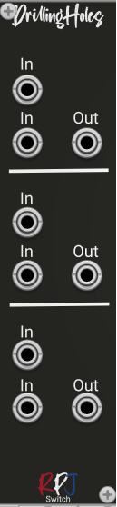

# Drilling Holes / Switch 

Drilling Holes is a simple polyphonic utility that gives you 3 blocks where you can connect 2 inputs and one output. If the lower input is connected, that signal will always be fed to the output. If the lower is empty, the upper input will be directed to the output. 

## Controls
This module has no controls.

## Credits
This functionality was requested by [mosphaere](https://community.vcvrack.com/u/mosphaere) in this article in the [VCV Rack community](https://community.vcvrack.com/t/looking-for-a-normalizer-switch/13772)
