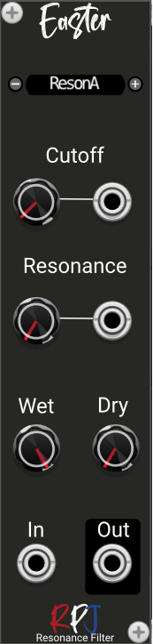

# Easter / Resonance filter 

Easter is a resonance filter module that delivers 2 different resonators. A resonator is a Band pass filter (BPF) that can be made to have a very narrow peak. 

One of the resonators delivered is a standard type (ResonA) and the other is a Smith-Angell resonator (ResonB). 

The basic resonator (ResonA) implements a single conjugate pair of poles in a 2nd order feedback topology. The drawback to this design is that the frequency response is symmetrical only at one frequency,  π/2, when the low frequency and high frequency magnitude vectors are symmetrical. At all other  frequencies, the response is shifted asymmetrically.

The improved design (ResonB) , known as the Smith-Angell resonator, reduces this asymmetry problem.

You can choose the filters by clicking the small + and - buttons at each side of the display.

## Controls
The Cutoff knob controls the center frequency of the filters.

The Resonance knob of controls the 3 dB bandwidth.

With the Wet knob you control the amount of processed sound/signal that will be mixed at the output.

The Dry knob controls the amount of unprocessed sounds that comes from the input straight into the mixed audio output.

## Credits
The module is an implementation of the formula's and theory from the book [Designing Audio Effect Plugins in C++](https://www.amazon.co.uk/Designing-Software-Synthesizer-Plugins-Audio/dp/0367510464) from Will C. Pirkle.