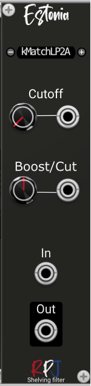

# Estonia / 1st Order Shelving Filters 

Shelving filters are used in many tone controls, especially when there are only two (bass and treble)  which are almost always implemented as shelf types. The filters specify a shelving frequency and gain or attenuation value.

## Controls
**Cutoff** knob controls the shelving frequency of the filters.

The **Boost/Cut** knob controls the LF or HF shelf gain/attenuation in dB.

From the menu the Biquadric **structure** can be selected that will be used for the filter arithmetic. There are 4 options to select from: Direct, Canonical, TransposeDirect and TransposeCanonical.

The direct forms (direct form and transposed direct form) are the simplest to implement but are also the  most susceptible to errors. The transposed canonical form is generally regarded as the best structure 
for floating point implementations due to the way the multiple summers split the work and add similarly sized values. There are also pros and cons with using the various structures with modulation  of the filter frequency, especially when the modulation value changes rapidly. 

## Credits
The module is an implementation of the formula's and theory from the book [Designing Audio Effect Plugins in C++](https://www.amazon.co.uk/Designing-Software-Synthesizer-Plugins-Audio/dp/0367510464) from Will C. Pirkle.