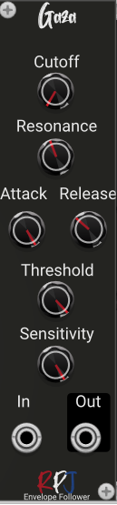

# Gaza / Envelope follower 

Gaza is an EnvelopeFollower which contains two DSP objects: AudioDetector and ZVAFilter, which  implement the detector and filter respectively. The AudioDetector is set for RMS detection, converted  to dB, with the ability to detect values above 0 dB Full Scale (dBFS). The ZVAFilter is configured as a 2nd order SVF LPF with gain compensation (reduced gain with increased Q), nonlinear processing and matched analog Nyquist frequency (there is some error at high Q  and high fc values). 

The envelope detector tracks an audio signal, and its output is compared with the threshold value. Then, a decision is made on how to process the audio input signal depending on whether the detected envelope is above or below the threshold. This usually involves a calculation that depends on the distance the detector’s output lies above or below the threshold. In some cases the threshold and detector outputs will be compared in dB form. Gaza uses the envelope detector to move the location of the cutoff frequency of a filter. The filter’s cutoff frequency travels across some range that the user sets as the cutoff. In Gaza we will track the input envelope level. When the input envelope is below a user-established threshold, the low-pass filter will use the GUI control cutoff setting as its cutoff frequency. When the signal travels above the threshold, we measure the distance and move the cutoff frequency up, starting from the GUI control cutoff setting. The cutoff value will move up and down linearly as the envelope changes above the threshold. Increasing the sensitivity control makes the cutoff frequency move more  quickly through its excursion, while decreasing it does the opposite. In Gaza we do the dB conversion in the audio detector so the detector’s attack and release slopes are in dB as well.

## Controls
The **Cutoff** knob controls the cutoff range. For details please see the discription above.

**Resonance** controls the Quality for the ZVAFilter. For a detailed explanation see the description above this paragraph,

The **Attack and Release** knobs control the attack and release slopes as described at the beginning of this manual.

**Threshold** and **Sensitity** are used to control the calculation of the cutoff frequency. A more detailed description is given in the explanation of the module in the previous paragraph.

## Credits
The module is an implementation of the formula's and theory from the book [Designing Audio Effect Plugins in C++](https://www.amazon.co.uk/Designing-Software-Synthesizer-Plugins-Audio/dp/0367510464) from Will C. Pirkle.