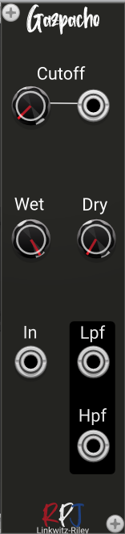

# Gazpacho / 2nd Order Linkwitz-Riley LPF and HPF 

Gazpacho is a Polyphonic module that delivers a 2nd Order Linkwitz-Riley Low-pass and High-pass filter. These filters are designed to have an attenuation of −6 dB at the corner frequency rather than the standard −3 dB. Their outputs sum exactly  and the resulting response is flat. They are often used in crossovers.

## Controls
**Cutoff** knob controls the center frequency of the filters.

With the **Wet** knob you control the amount of processed sound/signal that will be mixed at the output.

The **Dry** knob controls the amount of unprocessed sounds that comes from the input straight into the mixed audio output.

From the menu the Biquadric **structure** can be selected that will be used for the filter arithmetic. There are 4 options to select from: Direct, Canonical, TransposeDirect and TransposeCanonical.

The direct forms (direct form and transposed direct form) are the simplest to implement but are also the  most susceptible to errors. The transposed canonical form is generally regarded as the best structure 
for floating point implementations due to the way the multiple summers split the work and add similarly sized values. There are also pros and cons with using the various structures with modulation  of the filter frequency, especially when the modulation value changes rapidly. 

## Credits
The module is an implementation of the formula's and theory from the book [Designing Audio Effect Plugins in C++](https://www.amazon.co.uk/Designing-Software-Synthesizer-Plugins-Audio/dp/0367510464) from Will C. Pirkle.