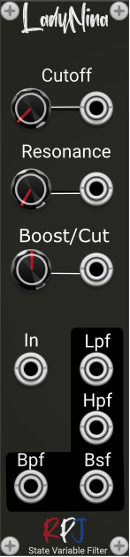

# Lady Nina / 2nd Order State Variable VA Filter 

Zavalishin (2012) proposed a bunch of new filter algorithms in the excellent (and free) book The  Art of VA Filter Design. These algorithms attempt to simulate analog filters by implementing their  analog block diagrams.

Lady Nina is simulating the analog state Variable filter  (SVF). This well-studied topology is a multi-filter design that produces 2nd order LPF, HPF, BPF, and  BSF responses from one topology, and there are numerous analog circuit variations. The digital version  is sometimes called the “Chamberlin Filter” due to its appearance in Chamberlin’s seminal book  Musical Applications of Microprocessors from 1985.

Lady Nina is now Polyphonic, just like most of our modules.

## Controls
The **Cutoff** knob controls the cutoff frequency of the filters.

**Resonance** controls the quality factor Q.

The **Boost/Cut** knob controls the gain/attenuation (boost/cut) in dB.

From the menu a couple of additional settings can be accessed. There are 4 in total:

When you **Enable Gain Compensation** option for the SVF LPF it will reduce the filter gain based on the following criteria: for every dB increase in peak gain due to increased Q, we lower the filter response by half that value in dB. Adding this gain compensation in combination with **Match gain at Nyquist for LPF** produces a very musical sounding filter.

**Enable NLP** enables the Non-linear processing.

When you **Enable Self Oscilation** the filter with start self oscilating where the Q will go to infinite when set to Q=20 (max).

## Credits
The module is an implementation of the formula's and theory from the book [Designing Audio Effect Plugins in C++](https://www.amazon.co.uk/Designing-Software-Synthesizer-Plugins-Audio/dp/0367510464) from Will C. Pirkle.