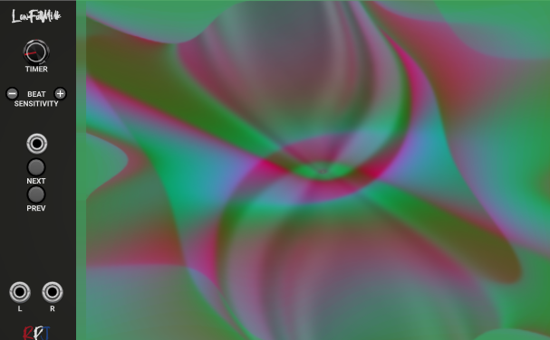
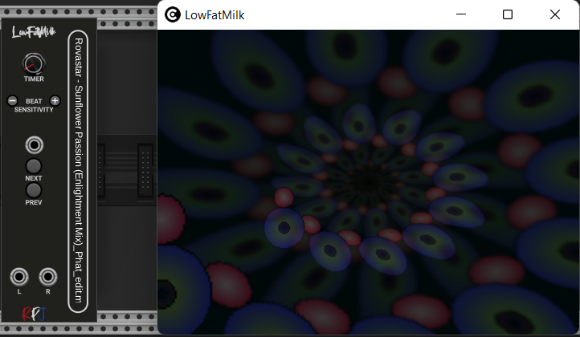
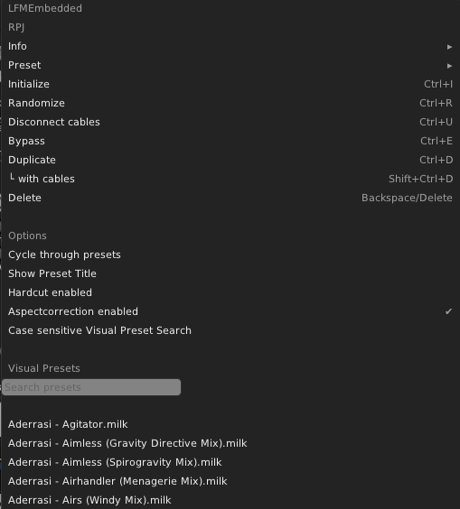
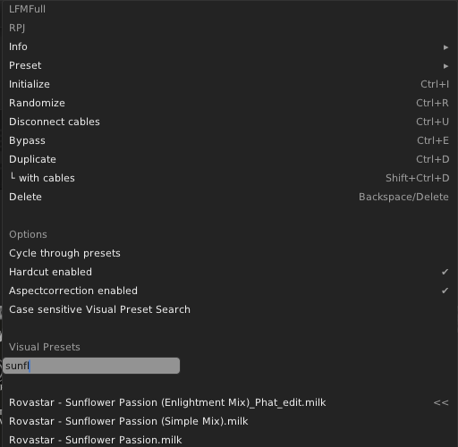

# LowFatMilk (LFM) 

Experience psychedelic and mesmerizing visuals by transforming music into equations that render into a limitless array of user-contributed visualizations.

Its purpose in life is to read audio input and to produce mesmerizing visuals, detecting tempo, and rendering advanced equations into a limitless array of user-contributed visualizations.

LowFatMilk embeds projectM, an open-source project that reimplements the esteemed Winamp Milkdrop by Geiss in a more modern, cross-platform reusable library and can be downloaded from <a href="https://github.com/projectM-visualizer/projectm">here</a>. The sources can also be requested by sending an email to robert.kock@gmail.com.

## Modules

LowFatMilk comes in two versions, an embedded widget and a seperate windo version that can be dragged onto a seperate monitor.

Above is the embedded version. This version is a module and the display is sticked to the module. You can increase the size of the display (resize the window). By rightclicking the module you will get the option to change specific settings of the module that will control the rendering and also gives you an option to search in your list of available presets.

The windowed version has similar functionalities as the embedded version, but a major difference is that the display is not sticked to the module but can be dragged to wherever you want it to go. It can even go to a different monitor, if you have multiple monitors installed in your setup.

## Menu

The menu shown here offers different options that let you control the module. We will explain each option below.

### Cycle through presets
Right clicking the module gives you the option to enable or disable Cycle through presets. If this is enabled the module will automatically jump to another preset. The time it stays with a preset can be set by the timer knob on the module.

### Hardcut Enabled
If Hardcut is enabled switching presets won't be done fluidly but quit abrupt. When it is disabled the transfer between presets will go more fluidly which might result in nice additional effects.

### Aspectcorrection Enabled
Enables or disables aspect ratio correction in presets that support it.
This sets a flag presets can use to aspect-correct rendered shapes, which otherwise would be distorted if the window display isn't exactly square.

### Case sensitive Visual Preset Search
This setting is used for the search option. If this is enabled the search will take place Case sensitive (so it will make differnce between lowercase and uppercase).

### Visual Presets
Below it one can see the Visual presets that are available. The list can be huge, and to make it easier to navigate to the right preset a searchbox is available where you can type to find the desired preset.

## Knobs, Buttons and Jacks

### Timer
With the timer knob you can set the time that the preset will stay active when the menu option is set to cycle through presets. The time can vary between 0 and 300 seconds.

### Beat sensitivity
This is a value that varies between 0 and 5 and can be controlled by the buttons on the left and right. Left to be used to lower the sensitivty and right to increase the value.

### Next
There is a next button and a next input, and both have the same functionality. If next is triggered it depends on the setting of Cycle through presets what will happen. If it is enabled, a random preset will be shown next. If Cycle through presets is disabled the next preset in line will be shown.

### Prev
Same as next, but instead of the next preset it will show the previous. 

## Controlling the window

### Resizing the window
If you put your mouse at the right end of the module you can drag the window and you can make the window bigger or smaller, depending on your requirements.

### Full Screen
If you have the windowed version of the module active, clicking it and pressing the 'enter' key will make the window Full screen. By pressing the 'Esc' key you will get back to normal size

