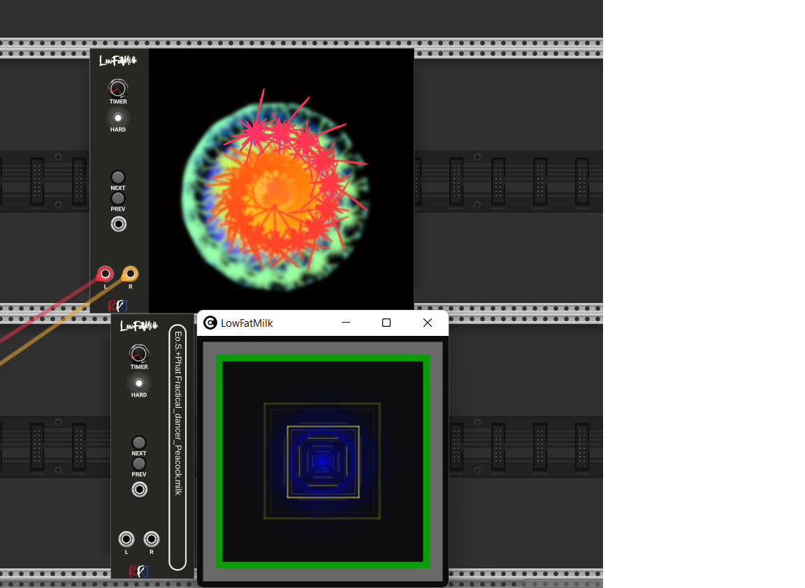

# LowFatMilk (LFM) 

Experience psychedelic and mesmerizing visuals by transforming music into equations that render into a limitless array of user-contributed visualizations.

Its purpose in life is to read audio input and to produce mesmerizing visuals, detecting tempo, and rendering advanced equations into a limitless array of user-contributed visualizations.

LowFatMilk embeds projectM, an open-source project that reimplements the esteemed Winamp Milkdrop by Geiss in a more modern, cross-platform reusable library and can be downloaded from <a href="https://github.com/projectM-visualizer/projectm">here</a>. The sources can also be requested by sending an email to robert.kock@gmail.com.

LowFatMilk comes in two versions, an embedded widget and a seperate windo version that can be dragged onto a seperate monitor.

## Cycle through presets
Right clicking the module gives you the option to enable or disable Cycle through presets. If this is enabled the module will automatically jump to another preset. The time it stays with a preset can be set by the timer knob on the module.

## Next
There is a next button and a next input. If next is triggered it depends on the setting of Cycle through presets what will happen. If it is enabled, a random preset will be shown next. If Cycle through presets is disabled the next preset in line will be shown.

## Prev
Same as next, but instead of the next preset it will show the previous. 

## Resizing the window
If you put your mouse at the right end of the module you can drag the window and you can make the window bigger or smaller, depending on your requirements.

## Full Screen
If you have the windowed version of the module active, clicking it and pressing the 'enter' key will make the window Full screen. By pressing the 'Esc' key you will get back to normal size

