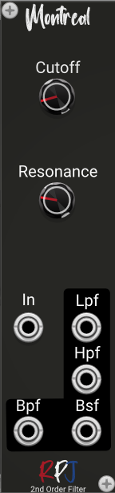

# Montreal / Ideal 2nd Order RLC Filters 

Montreal is a set of ideal RLC filters that form the basis for many  important analog EQ designs. 

## Controls
For the LPF and BPF, **Cutoff** is the cutoff frequency, while for BPF and BSF, it is the center frequency.

For  LPF and BPF, **Resonance** is the quality or resonant peaking factor, while for BPF and BSF, Q = fo/BW where  BW is the −3 dB bandwidth.

## Credits
The module is an implementation of the formula's and theory from the book [Designing Audio Effect Plugins in C++](https://www.amazon.co.uk/Designing-Software-Synthesizer-Plugins-Audio/dp/0367510464) from Will C. Pirkle.