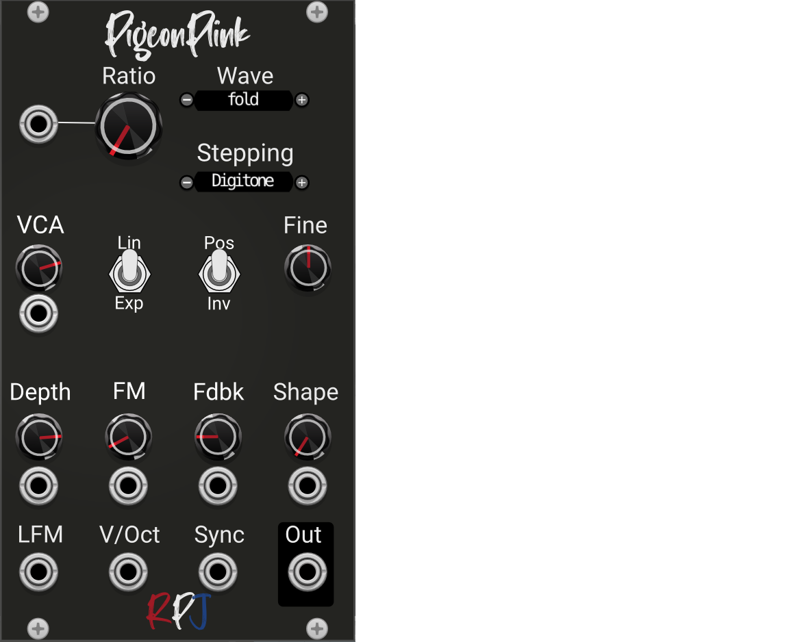

# Pigeon Plink / VCO 

Pigeon Plink is a VCO that contains a sinewave oscillator that can do "through zero linear FM", a wave-shaper, and a bunch of VCAs. If you are familiar with the Kitchen Sink from Squinky Labs, it's a lot like that, but we have made it more FM friendly.

# Credits
**Squinky Labs:** Without SL we never would have created this module. We used [Kitchen Sink](https://github.com/kockie69/SquinkyVCV-main/blob/master/docs/kitchen-sink.md) as the base for our ideas and also made heavily use of the original code.

**[Tana Barbier](https://community.vcvrack.com/u/tanabarbier/summary):** Thanks for your input on the specs and testing.

**[Markus](https://community.vcvrack.com/u/mosphaere/summary):** Thanks for raising the initial request, providing me the specs and ideas and your testing time.