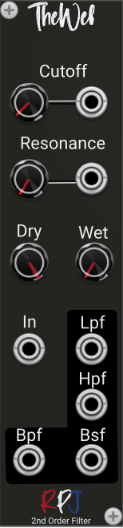

# The Web / Second order Butterworth LPF/HPF/BPF/BSF filter 

The Web is a Polyphonic second order Butterworth Low-pass, High-pass, Band-pass and Band-stop filter. Butterworth LPFs and HPFs are specialized versions of the ordinary 2nd order HPF. Their Q values are  fixed at 0.707, which is the largest value it can assume before peaking in the frequency response is observed.  The frequency responses are essentially identical to the general 2nd order filters with a Q of 0.707. 

Butterworth BPFs and BSFs have an adjustable bandwidth that is related to Q. The frequency  responses are essentially identical to the general 2nd order BPFs and BSFs. 

## Controls
**Cutoff** knob controls the corner frequency of the filters.

For the LPF and HPF the **Resonance** knob is the quality factor controlling the resonant peaking. For the BPF and the BSF it is the quality factor controlling width of peak or notch = 1/Bandwidth.

With the **Wet** knob you control the amount of processed sound/signal that will be mixed at the output.

The **Dry** knob controls the amount of unprocessed sounds that comes from the input straight into the mixed audio output.

From the menu the Biquadric **structure** can be selected that will be used for the filter arithmetic. There are 4 options to select from: Direct, Canonical, TransposeDirect and TransposeCanonical.

The direct forms (direct form and transposed direct form) are the simplest to implement but are also the  most susceptible to errors. The transposed canonical form is generally regarded as the best structure 
for floating point implementations due to the way the multiple summers split the work and add similarly sized values. There are also pros and cons with using the various structures with modulation  of the filter frequency, especially when the modulation value changes rapidly. 

## Credits
The module is an implementation of the formula's and theory from the book [Designing Audio Effect Plugins in C++](https://www.amazon.co.uk/Designing-Software-Synthesizer-Plugins-Audio/dp/0367510464) from Will C. Pirkle.