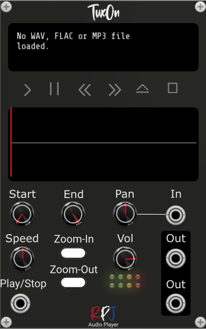

# Tuxon / Audio Player 

Tuxon is a stereo Audio Player that can play WAV, MP3 and FLAC format audio files. Using its display and controls the user can drilldown into a specific area within the sample. The pattern for playing can be selected, one can choose between single, repeat and ping-pong (where the sample will be played normal and backwards depending on the direction). As the sample length can be set to whatever length the user wants (even 1 sample is possible) it can be perfectly used for granular synthesis. The player currently has cv-inputs to control the panning and to trigger stop/start for the player. By putting the begin line (green colour) to the right of the end line (red colour) the sample will be played backwards. 

## Controls
Below the top display are 6 buttons that can be pressed to control the sample. From left to right these buttons are **Play**, **Pause**, **Fast backward**, **Fast forward**, **Eject** and **Stop**.
Fast backward and Fast forward can be pushed until the Play line is at the position rquired. The other buttons van be controlled with a single push. 

When you push Eject you get the option to select and load a new file. The same can be achieved by going to the menu and pressing **Select Audio File**.

The **Start** and **End** knobs let you control the begin and ens position of the loaded sample. 

**Pan** gives you the option to pan the sound and can be modulated using the input next to the knob.

**Speeds** lets you play the sample faster or slower. 

**Volume** lets you control the volume, where the leds below give you an idea about the current level.

The **Zoom-In** and **Zoom-Out** buttons give you the option to drill down and get to access to a specific area in your sample. Ideal for granular synthesis. 

The menu of the module gives you two additional control settings. One is the **Panningtype** (**Simple** or **Constant Power**) that can be selected and the other one is **PlayMode**. Here you can choose between:
**Single**, the sample will be played from the Begin postion till the End postion only once.
**Repeat**, the sample will be played from the Begin postion till the End postion until it is stopped by pressing the Pause or Stop button or by triggering using the **Play/Stop** CV-input.
**PingPong**, the sample will be played from the Begin postion till the End postion until it is stopped by pressing the Pause or Stop button or by triggering using the **Play/Stop** CV-input. When it reaches the begin or end position it will reverse its direction (which may result in playing the sample backwards ).

